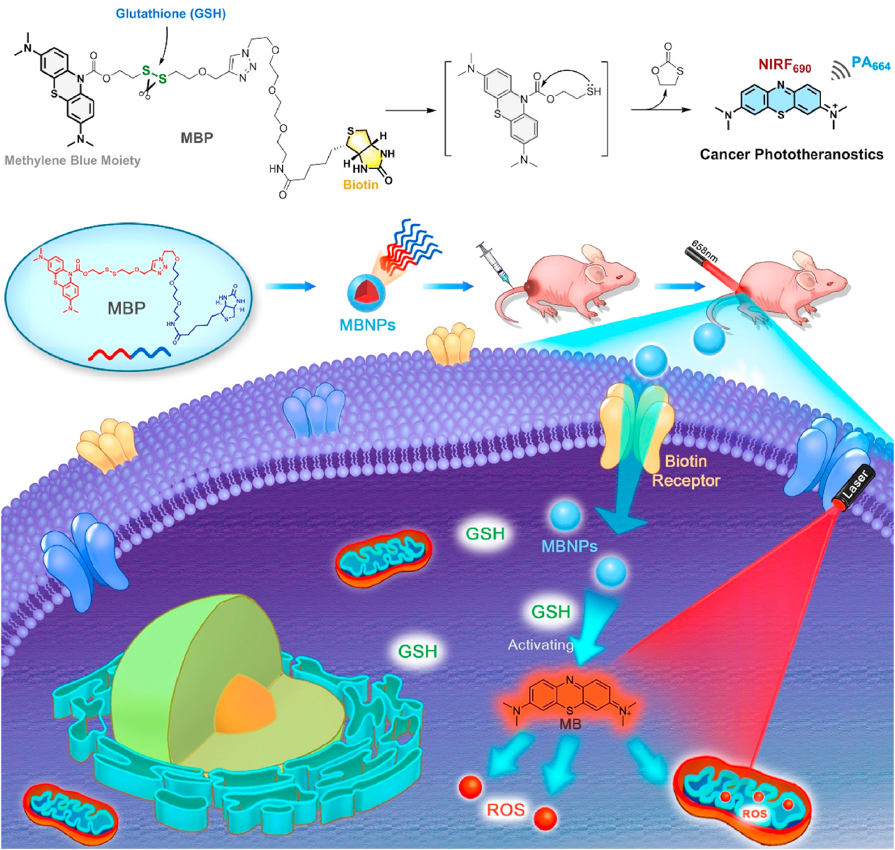

##### Graphic abstract

---

##### Abstract

Cancer treatment currently still faces crucial challenges in therapeutic effectiveness, precision, and complexity. Photodynamic therapy (PDT) as a non-invasive tactic has earned widespread popularity for its excellent therapeutic output, flexibility, and restrained toxicity. Nonetheless, drawbacks, including low efficiency, poor cancer specificity, and limited therapeutic depth, remain considerable during the cancer treatment. Although great effort has been made to improve the performance, the overall efficiency and biosafety are still ambiguous and unable to meet urgent clinical needs. Herein, this study integrates merits from previous PDT strategies and develops a cancer-targeting, activatable, biosafe photosensitizer. Owing to excellent self-assembly ability, this photosensitizer can be conveniently prepared as multifunctional nano-photosensitizers, namely MBNPs, and applied to in vivo cancer phototheranostics in “all-in-one” mode. This study successfully verifies the mechanism of MBNPs, then deploys them to cell-based and in vivo cancer PDT. Based on the unique cancer microenvironment, MBNPs achieve precise distribution, accumulation, and activation towards the tumor, releasing methylene blue as a potent photosensitizer for phototherapy. The PDT outcome demonstrates MBNPs’ superior cancer specificity, remarkable PDT efficacy, and negligible toxicity. Meanwhile, in vivo NIR fluorescence and photoacoustic imaging have been utilized to guide the PDT treatment synergistically. Additionally, the biosafety of the MBNPs-based PDT treatment is ensured, thus providing potential for future clinical studies.

---

##### Download

+ [PDF](biom.pdf)
+ [ScienceDirect](https://doi.org/10.1016/j.biomaterials.2022.121916)
+ [PubMed](https://pubmed.ncbi.nlm.nih.gov/36410110/)

---

##### Citation

Cheng, K.#; **Qi, J.**#; Zhang, J.; Li, H.; Ren, X.; Wei, W.; Meng, L.; Li, J.; Li, Q.; Zhang, H.; Deng, W.; Sun, H.; Mei, L., Self‑
assembled nano‑photosensitizer for targeted, activatable, and biosafe cancer phototheranostics. **_Biomaterials_** 2022,
291, 121916.

---
