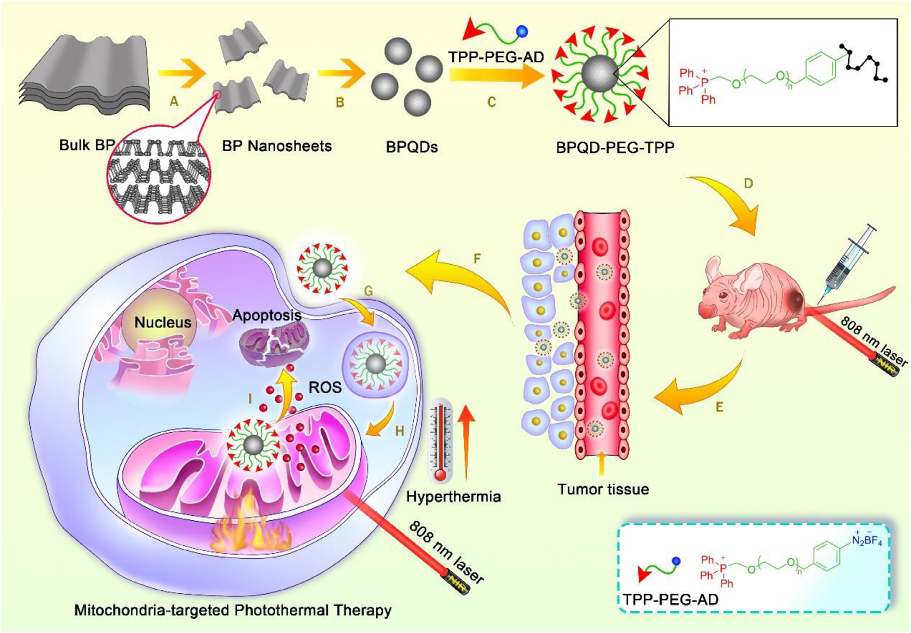

---

##### Download

+ [PDF](ajps.pdf)
+ [ScienceDirect](https://doi.org/10.1016/j.ajps.2020.09.001)
+ [PubMed](https://pubmed.ncbi.nlm.nih.gov/33995616/)

---

##### Abstract

Black phosphorus (BP) nano-materials, especially BP quantum dots (BPQDs), performs outstanding photothermal antitumor effects, excellent biocompatibility and biodegradability. However, there are several challenges to overcome before offering real benefits, such as poor stability, poor dispersibility as well as difficulty in tailoring other functions. Here, a "three-in-one" mitochondria-targeted BP nano-platform, called as BPQD-PEG-TPP, was designed. In this nano-platform, BPQDs were covalently grafted with a heterobifunctional PEG, in which one end was an aryl diazo group capable of reacting with BPQDs to form a covalent bond and the other end was a mitochondria-targeted triphenylphosphine (TPP) group. In addition to its excellent near-infrared photothermal properties, BPQD-PEG-TPP had much enhanced stability and dispersibility under physiological conditions, efficient mitochondria targeting and promoted ROS production through a photothermal effect. Both in vitro and in vivo experiments demonstrated that BPQD-PEG-TPP performed much superior photothermal cytotoxicity than BPQDs and BPQD-PEG as the mitochondria targeted PTT. Thus this "three-in-one" nanoplatform fabricated through polymer grafting, with excellent stability, dispersibility and negligible side effects, might be a promising strategy for mitochondria-targeted photothermal cancer therapy.

---

##### Graphic abstract

---

##### Citation

**Qi, J.**; Xiong, Y.; Cheng, K.; Huang, Q.; Cao, J.; He, F.; Mei, L.; Liu, G.; Deng, W., Heterobifunctional PEG‑grafted black phosphorus quantum dots: "Three‑in‑One" nanoplatforms for mitochondria‑targeted photothermal cancer therapy. **Asian J. Pharm. Sci.** _2021_, 16 (2), 222‑235.

---
